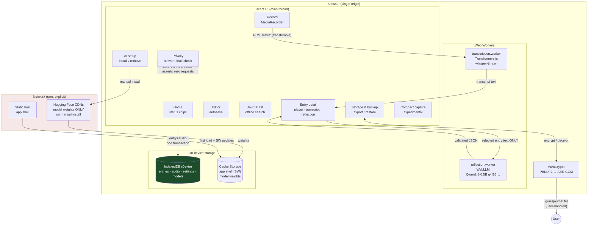

# Architecture — Grass Journal 0.1.0

## Data-flow rules (enforced, not aspirational)

1. **Journal data ↔ IndexedDB only.** The service worker caches the app shell and
   model weights — never entries, audio, transcripts, or reflections.
2. **Audio commits first.** `stopAndSave()` writes entry + audio in one Dexie
   transaction and resolves only after commit. Transcription is a separate,
   manual, later step.
3. **AI sees the minimum.** The transcription worker receives one audio sample;
   the reflection worker receives one entry's text. Neither can see the journal.
   Workers are terminated after use (reflection) or idle-reusable (transcription).
4. **AI output is metadata.** Reflections and transcripts are validated (zod),
   labeled with model + prompt version, editable, deletable — and never overwrite
   `bodyText`.
5. **Backups are user-mediated.** Encryption happens in-page; the file download
   is the only exfiltration path, and it requires the user's passphrase.
6. **No silent network.** The only `connect-src` hosts are model CDNs, hit only
   during explicit installs. The privacy screen proves the workflows are silent.

## Module map

| Path | Responsibility |
|---|---|
| `src/db.ts` | Dexie schema, transactions, settings |
| `src/lib/types.ts` | Versioned data schema |
| `src/lib/validation.ts` | zod schemas: entries, AI JSON, backup envelope |
| `src/lib/backup.ts` | AES-GCM export/restore, integrity, dedupe |
| `src/lib/netcheck.ts` | Privacy-verification interceptor |
| `src/lib/capability.ts` | WebGPU/WASM/mic/storage probing |
| `src/audio/recorder.ts` | MediaRecorder lifecycle, immediate commit |
| `src/ai/*.worker.ts` | Transcription / reflection engines |
| `src/ai/*Client.ts` | Worker clients (transferables, progress) |
| `src/ai/prompts.ts` | Versioned system prompt (`reflect-v1`) |
| `src/ai/deterministic.ts` | No-model keyword fallback |
| `src/screens/*` | The ten screens |
| `src/demo/seed.ts` | Labeled demo data (synthetic audio) |
